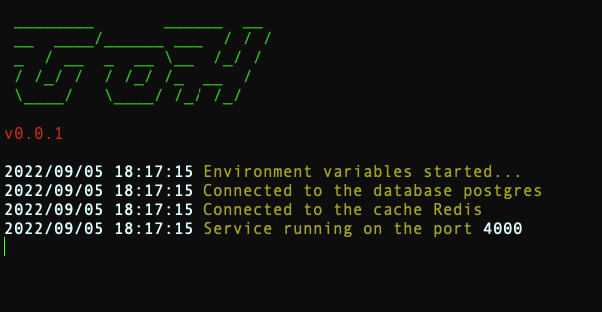

<h1 align="center">Contablue</h1>

Conta Blue é uma versão simples de um aplicativo de gestão financeira e vendas, uma alusão a plataforma Conta Azul (para fins de estudos). Neste aplicativo foi usado Go no Back-end, Angular no Front-end, Postgresql banco de dados e Redis para Cache

  

## ✨ Padrões e Princípios

Esse projeto foi desenvolvido com os seguintes Pattern e Design:

- Clean architecture
- Controller
- Service
- Repository
- IoC

Princípios SOLID:

- Dependency inversion principle
- Single-responsibility principle

## ✨ Tecnologias

Esse projeto foi desenvolvido com as seguintes tecnologias:

- [Go](https://go.dev/)
- [Postgresql](https://www.postgresql.org/docs/)
- [Redis](https://www.postgresql.org/docs/)
- [GoH](https://github.com/joaocprofile/goh)
- [JSON Web Token](https://jwt.io/)
- [Angular](https://angular.io/)
- [PrimeNG](https://www.primefaces.org/primeng/)

## 🚀 Como executar a API:

> Nesse projeto temos autenticação via OAuth normal usuário e senha, não esqueça de criar uma SECRET JWT no .env

- Clone o repositório e acesse a pasta;
- Faça uma copia do arquivo `.env.example` para `.env` e preencha com as suas credenciais e variáveis dos demais serviços.;
- Precisa está com Postgresql e Redis instaldo, se for usar docker digite no shell o cmd:
  `docker-compose up -d`;
- Execute o script DDL [`db/migrations/00001_initial_schema.sql`] no banco de dados
- Para executar a API `go run main.go`;

A aplicação pode ser acessada em [`localhost:4000`](http://localhost:4000/). se não foi alterada a porta padrão.

## 🚀 Como executar o Front-end:

> Em breve....

## 📄 Licença

Esse projeto está sob a licença MIT. Veja o arquivo [LICENSE](LICENSE) para mais detalhes.

---

Feito com ♥ by @joaocprofile 👋🏻 &nbsp;
